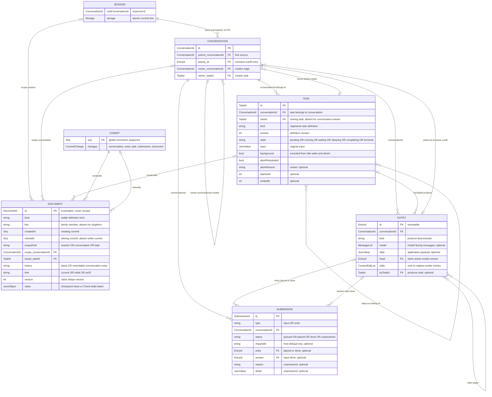

# pi-durable experiments

https://github.com/earendil-works/pi/tree/main/packages/durable

## Usage

```shell
source .env
watchexec -c -w src "node src/[module]"
```

## Datamodel


```mermaid
erDiagram
    SESSION ||--o{ CONVERSATION : "owns (conceptual, no FK)"
    SESSION |o--o{ DOCUMENT : "scope.session"
    CONVERSATION ||--o{ ENTRY : "conversationId"
    CONVERSATION |o--o{ DOCUMENT : "scope.conversation"
    TASK |o--o{ DOCUMENT : "scope.task"
    COMMIT ||--o{ DOCUMENT : "createdAt"
    COMMIT |o--o{ DOCUMENT : "retiredAt"

    CONVERSATION |o--o{ CONVERSATION : "parent.conversationId fork source"
    ENTRY |o--o{ CONVERSATION : "parent.at inclusive cutoff"
    CONVERSATION |o--o{ CONVERSATION : "owner.conversationId creator"
    TASK |o--o{ CONVERSATION : "owner.taskId creator"

    CONVERSATION ||--o{ TASK : "conversationId belongs to"
    TASK |o--o{ TASK : "owner child to parent"
    TASK }o--o{ TASK : "state.on waiting on"

    TASK |o--o{ ENTRY : "byTaskId producer"
    ENTRY |o--o{ ENTRY : "head context start"
    ENTRY }o--o{ ENTRY : "edits target"

    CONVERSATION ||--o{ SUBMISSION : "conversationId"
    ENTRY |o--o{ SUBMISSION : "entry placed or done"
    ENTRY |o--o{ SUBMISSION : "answer input done"

    SESSION {
        ConversationId rootConversationId "reserved id"
        Storage storage "atomic commit line"
    }

    CONVERSATION {
        ConversationId id PK
        ConversationId parent_conversationId FK "fork source"
        EntryId parent_at FK "inclusive cutoff entry"
        ConversationId owner_conversationId FK "creator edge"
        TaskId owner_taskId FK "creator task"
    }

    ENTRY {
        EntryId id PK "immutable"
        ConversationId conversationId FK
        string kind "protocol discriminator"
        MessageList model "model-facing messages; optional"
        JsonValue data "application payload; optional"
        EntryId head FK "starts active model context"
        ContextEditList edits "omit or replace earlier entries"
        TaskId byTaskId FK "producer task; optional"
    }

    TASK {
        TaskId id PK
        ConversationId conversationId FK "task belongs to conversation"
        TaskId owner FK "owning task; absent for conversation-owned"
        string kind "registered task definition"
        int version "definition version"
        string state "pending OR running OR waiting OR sleeping OR completing OR terminal"
        JsonValue input "original input"
        bool background "excluded from idle waits and aborts"
        bool abortRequested
        string abortReason "restart; optional"
        int startedAt "optional"
        int endedAt "optional"
    }

    DOCUMENT {
        DocumentId id PK "incarnation; never reused"
        string kind "stable definition kind"
        string key "family member; absent for singleton"
        Seq createdAt "creating commit"
        Seq retiredAt "retiring commit; absent while current"
        string scopeKind "session OR conversation OR task"
        ConversationId scope_conversationId FK
        TaskId scope_taskId FK
        string history "latest OR rewindable (conversation only)"
        string fork "current OR initial OR asOf"
        int version "value shape version"
        JsonObject value "checkpoint base or Chord delta batch"
    }

    SUBMISSION {
        SubmissionId id PK
        string type "input OR write"
        ConversationId conversationId FK
        string status "queued OR placed OR done OR unanswered"
        string requestId "host dedupe key; optional"
        EntryId entry FK "placed or done; optional"
        EntryId answer FK "input done; optional"
        string reason "unanswered; optional"
        JsonValue detail "unanswered; optional"
    }

    COMMIT {
        Seq seq PK "global monotonic sequence"
        CommitChange changes "conversation, entry, task, submission, document"
    }
```
